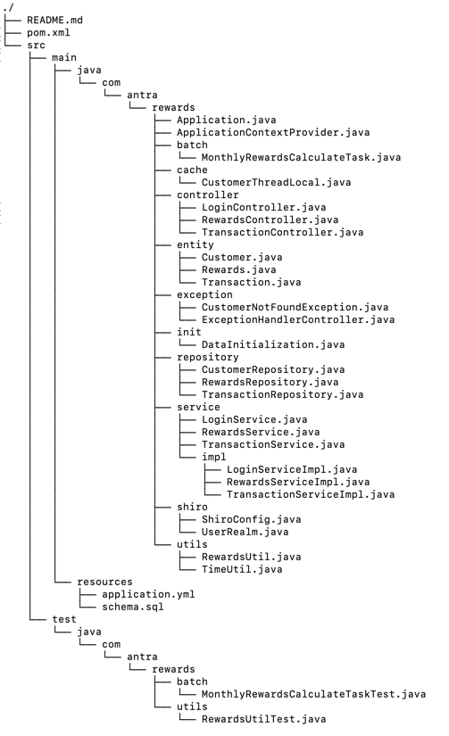
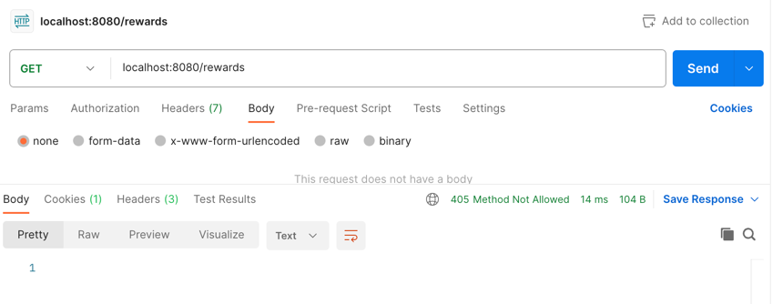
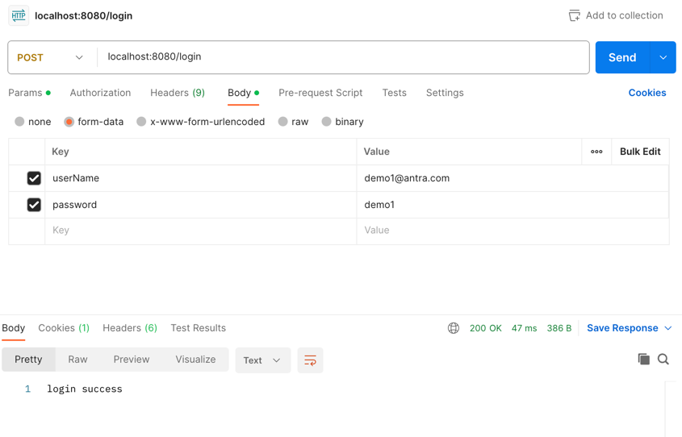
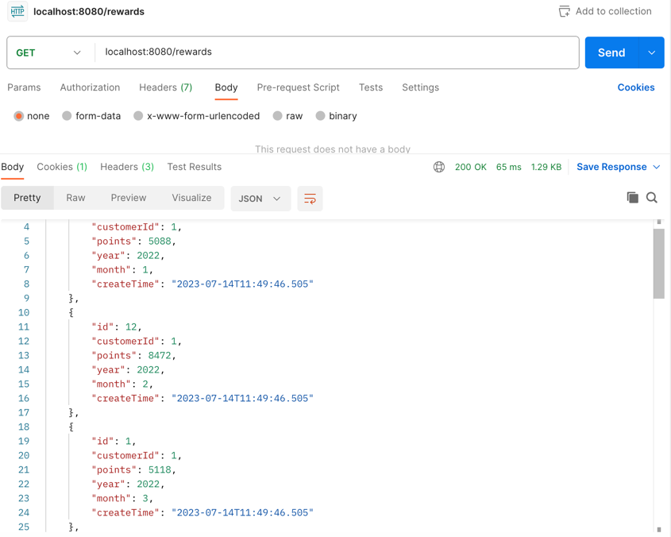
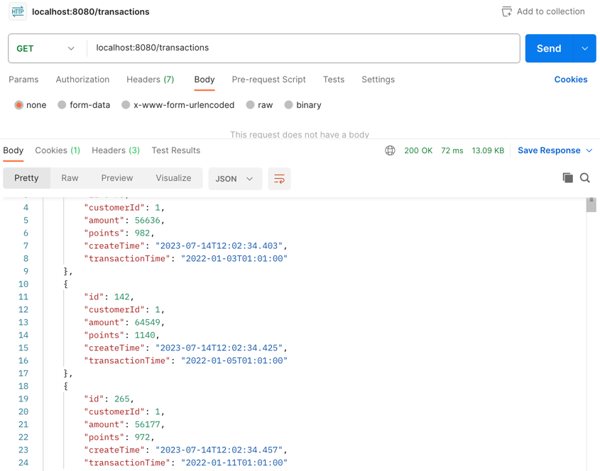
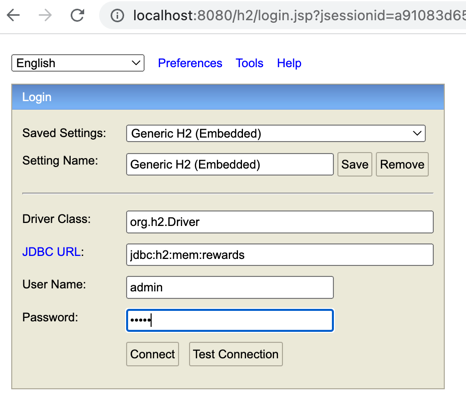
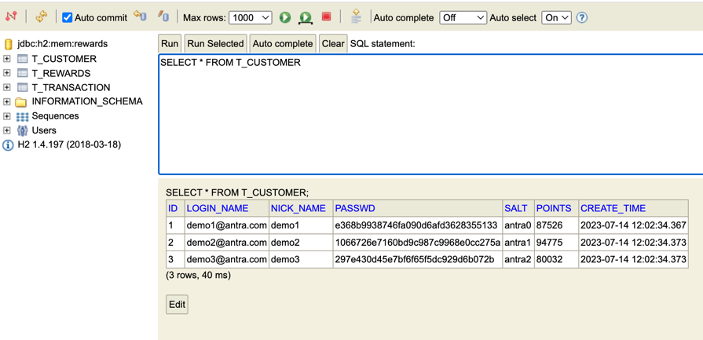
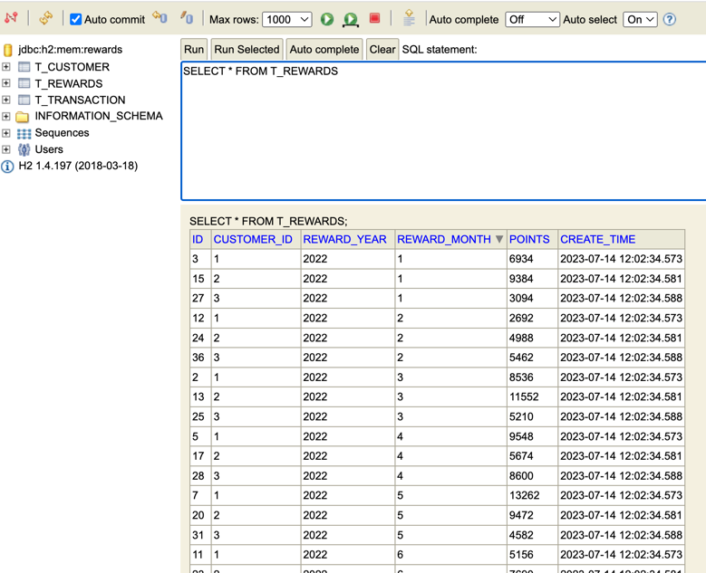
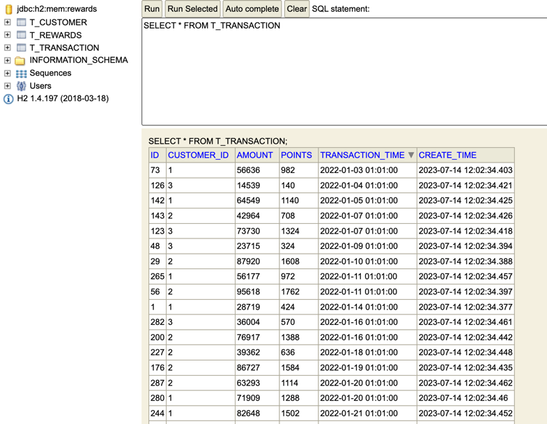

# Liam/Retailer Customer Rewards Project

## Business Requirement
A retailer offers a rewards program to its customers, awarding points based on each valid purchase. A customer receives 2 points for every dollar spent over $100 in each transaction, plus 1 point for every dollar spent over $50 in each transaction (e.g. if one customer spends $120 total in a transaction, then points earned is 2x$20 + 1x$50 = 90 points).
Given all the transactions of every customer during a period of time(1 year for example), calculate the reward points earned for each customer per month and total.
Solution Requirement
1. Create some Restful APIs to get customer's reward points. By customized input like user id or user name.
2. Use common sense to make assumptions.
3. Consider the API security and confidentiality of user data.
4. Make up a data set to best demonstrate your solution.
5. The solution should demonstrate the design of API, business logic and data storage.
6. Use SpringBoot 2 or 3.
7. Frontend is not required, but the solution should include instructions of how to build, run and validate the result.
8. The solution should be independently executed without any external dependencies like DB and APIs. Embedded DB is allowed.
9. Should have proper Unit test cases.

## Sample data and solution
1. Using Spring Boot in memory H2 DB for creation of sample data.
2. There are three schemas - Customer, Transaction and Rewards schema.
3. These three schemas have a Foreign key relationship. Queries to create these schemas are present in schema.sql under src/main/resources.
4. Schemas will be automatically loaded into H2 during the project starting process.
5. We registered a EventListener in DataInitialization class, which will execute after project started. And will automatically insert 3 customers into customer table and 300 hundred transactions with dynamic amounts in dynamic month in 2022 into transaction table(each customer 100 transactions).
6. Rewarded points to the transaction will be calculated when building the transaction.
7. When all the data ready, an async task which simulates the batch task will execute to calculate the reward points earned for each customer per month and total(MonthlyRewardsCalculateTask), calculate these data on api requests is not acceptable.
8. We use shiro to safeguard the API security. We can get customer's reward points after login to the system, or will get 405 error status code.
9. We can only see the rewards and transaction data of yourself, so the apis do not have customized input like user id, we can get it after log in and there is no need to pass it through api, this approach enhances the api safety.
10. We can have the apis which contains customized input like user id in operation support system which only can be accessed in the organization's intranet.
11. We use SpringBoot 2.1.2.RELEASE.

## Code Structure


## Test Cases
Create Test Cases under src/test/java for below scenarios(all the transaction store in cents unit):
### For single transaction reward points calculate in RewardsUtilTest.testCalculatePoints
1. Amount < 51_00
2. Amount > 51_00 & < 10_000
3. Amount >= 10_000
### For customer month and total reward points calculate in MonthlyRewardsCalculateTaskTest.testGenCustomerRewardsByMonth/testGenCustomerRewards
1. 5 transactions in 3 different month of customer with id 1
2. verify total size of rewards
3. verify points of each transaction
4. verify points of each month
5. verify customer total points

# To run
- git clone https://github.com/liamworkhard/antra_rewards.git
- mvn clean compile
- mvn spring-boot:run

# Health API
http://localhost:8080/actuator/
http://localhost:8080/actuator/health

Sample Response
```{"status":"UP"}```

# Urls:
1. To get rewards for current customer  -> /rewards
2. To get transactions for current customer  -> /transactions
3. We can support pagination and data filter features afterward.

After the program is run, user should log in first use:
1. curl --location 'localhost:8080/login' \
   --form 'userName="demo1@antra.com"' \
   --form 'password="demo1"'
2. And then enter either of the following link in the URL:
* http://localhost:8080/rewards
* http://localhost:8080/transactions
* When not log in
  
* do log in and request
  
  
  

# Database

To log into the H2 database to check the data in tables use following link:
http://localhost:8080/h2
1. Input JDBC URL ---> jdbc:h2:mem:rewards
2. Input password admin
3. Click 'Connect' button
   
   
   
   


